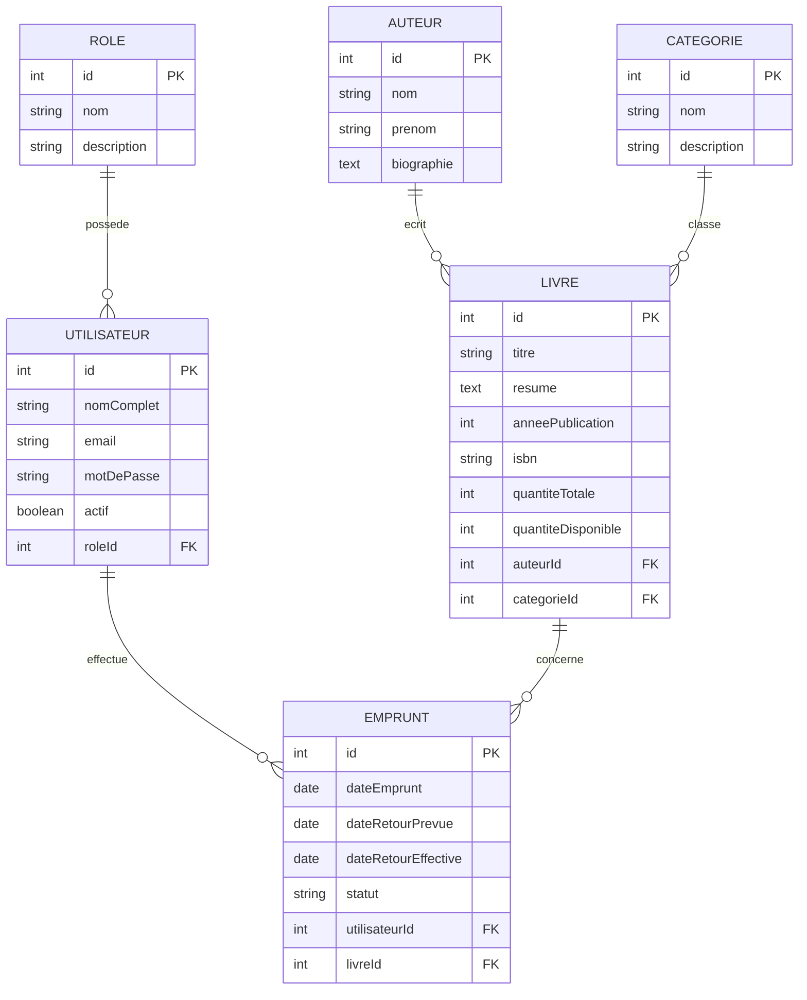

# Projet : API de gestion de bibliotheque

## Sujet choisi

Le sujet choisi est une application simple de gestion de bibliotheque.

## Modele entite-associations

## Resume du modele physique

- `roles` contient les types d'utilisateurs.
- `utilisateurs` contient les comptes et la relation avec les roles.
- `auteurs` contient les auteurs des livres.
- `categories` permet de classer les livres.
- `livres` stocke les informations des livres et les quantites disponibles.
- `emprunts` suit les emprunts en cours et les retours.
